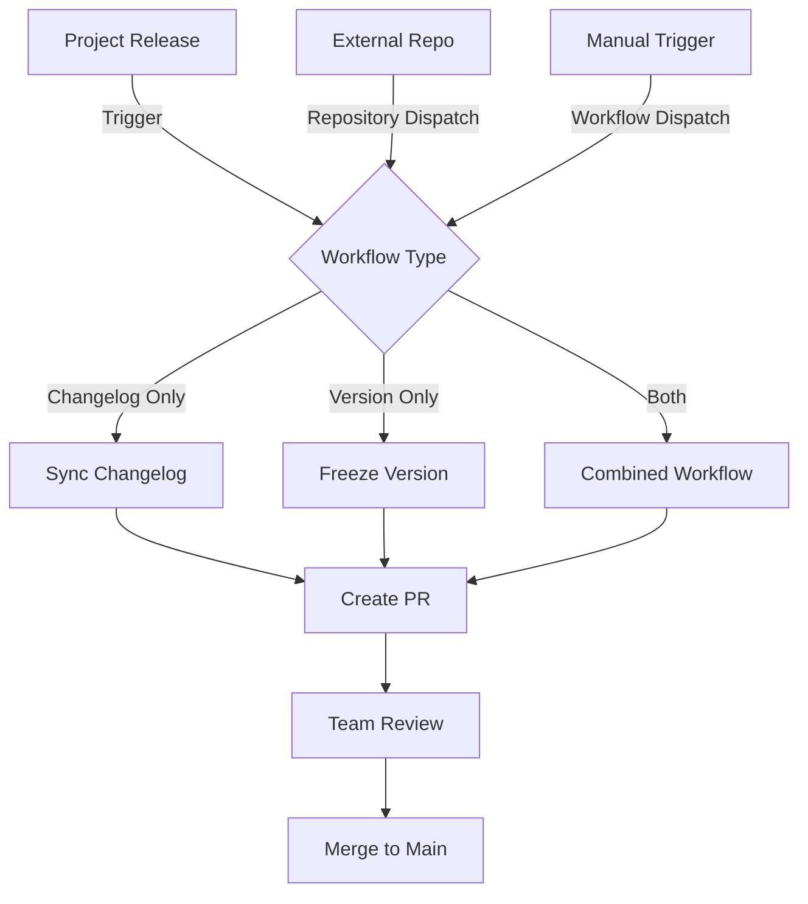

# Automation

Complete guide to setting up automated documentation workflows with GitHub Actions.

## Overview

Mintlifier provides comprehensive GitHub Actions workflows for:
- **Changelog Synchronization**: Automatically sync release notes from your project
- **Version Freezing**: Create immutable documentation snapshots on releases
- **Pull Request Workflow**: All changes go through PR review process
- **External Repository Support**: Trigger updates from separate project repositories

## Workflow Architecture



## Available Workflows

### 1. Changelog Sync (`sync-changelog.yml`)

Synchronizes release notes from your project repository.

**Features:**
- Fetches CHANGELOG.md from source repository
- Converts to MDX format with components
- Creates PR for review
- Supports specific versions or latest

**Triggers:**
- Manual via GitHub Actions UI
- External repository dispatch
- API call

### 2. Version Freeze (`freeze-version.yml`)

Creates immutable documentation snapshots for specific versions.

**Features:**
- Copies current docs to `/docs/[version]/`
- Updates all internal links
- Modifies mint.json configuration
- Creates PR for review

**Triggers:**
- Manual via GitHub Actions UI
- External repository dispatch
- On release publication

### 3. Combined Automation (`docs-automation.yml`)

Orchestrates both changelog sync and version freeze with proper sequencing.

**Features:**
- Ensures changelog updates before freezing
- Single PR for all changes
- Automatic version detection on releases
- Flexible action selection

**Triggers:**
- Release publication (automatic)
- Manual with action selection
- External repository dispatch

## Setup Instructions

### Step 1: Copy Workflow Templates

Copy the workflow templates to your documentation repository:

```bash
# Create workflows directory
mkdir -p .github/workflows

# Copy workflows from templates
cp workflow-templates/sync-changelog.yml .github/workflows/
cp workflow-templates/freeze-version.yml .github/workflows/
cp workflow-templates/docs-automation.yml .github/workflows/
```

### Step 2: Configure Repository Settings

#### Required Permissions

Ensure GitHub Actions has write permissions:

1. Go to **Settings** → **Actions** → **General**
2. Under **Workflow permissions**, select:
   -  Read and write permissions
   -  Allow GitHub Actions to create and approve pull requests

#### Branch Protection (Optional)

For production environments, configure branch protection:

1. Go to **Settings** → **Branches**
2. Add rule for `main` branch:
   -  Require pull request reviews
   -  Dismiss stale reviews
   -  Require status checks

### Step 3: Set Up External Triggers (Optional)

If your documentation is in a separate repository from your project:

#### In Documentation Repository

The workflows are already configured to accept `repository_dispatch` events.

#### In Project Repository

1. Create a Personal Access Token:
   - Go to **Settings** → **Developer settings** → **Personal access tokens**
   - Generate new token with `repo` scope
   - Copy the token

2. Add token as repository secret:
   - Go to project repo **Settings** → **Secrets** → **Actions**
   - Add new secret: `DOCS_REPO_TOKEN`
   - Paste the token value

3. Add the external trigger workflow:

```bash
# In your project repository
cp workflow-templates/external-repo-trigger.yml .github/workflows/trigger-docs.yml
```

4. Update the workflow configuration:

```yaml
env:
  DOCS_REPO: 'your-org/your-docs-repo'  # Update this
  DOCS_TOKEN: ${{ secrets.DOCS_REPO_TOKEN }}
```

## Usage Examples

### Manual Trigger via UI

1. Go to **Actions** tab in your repository
2. Select the workflow (e.g., "Documentation Automation")
3. Click **Run workflow**
4. Fill in parameters:
   - Action: `both`
   - Release version: `v1.2.0`
   - Next version: `v1.3.0`
5. Click **Run workflow**

### Trigger from External Repository

```yaml
# On release in project repository
on:
  release:
    types: [published]
```

The workflow automatically:
1. Detects the release version
2. Triggers documentation repository workflow
3. Creates PR in documentation repository

### API Trigger

```bash
# Trigger changelog sync
curl -X POST \
  -H "Authorization: token YOUR_PAT" \
  -H "Accept: application/vnd.github+json" \
  https://api.github.com/repos/YOUR_ORG/YOUR_DOCS/dispatches \
  -d '{
    "event_type": "sync-changelog",
    "client_payload": {
      "source_version": "v1.2.0"
    }
  }'

# Trigger version freeze
curl -X POST \
  -H "Authorization: token YOUR_PAT" \
  -H "Accept: application/vnd.github+json" \
  https://api.github.com/repos/YOUR_ORG/YOUR_DOCS/dispatches \
  -d '{
    "event_type": "freeze-version",
    "client_payload": {
      "release_version": "v1.2.0",
      "next_version": "v1.3.0"
    }
  }'
```

## Workflow Configuration

### Environment Variables

Configure in workflow files:

```yaml
env:
  # Source repository for changelog (if different)
  SOURCE_REPO: 'your-org/your-project'
  
  # Default branch
  DEFAULT_BRANCH: 'main'
  
  # Node version for scripts
  NODE_VERSION: '18'
```

### Customizing PR Creation

Modify the `create-pull-request` action parameters:

```yaml
- uses: peter-evans/create-pull-request@v5
  with:
    title: 'Custom PR Title'
    body: 'Custom PR description'
    labels: |
      documentation
      automated
      high-priority
    reviewers: |
      teamlead
      techwriter
    assignees: ${{ github.actor }}
    branch: custom-branch-name
```

### Version Naming Convention

The workflows support various version formats:

```yaml
# Semantic versioning
release_version: 'v1.2.3'
next_version: 'v1.3.0'

# Date-based versioning
release_version: '2024.01.15'
next_version: '2024.02.01'

# Custom format
release_version: 'release-5'
next_version: 'release-6'
```

## Advanced Features

### Conditional Changelog Updates

Control when changelog updates occur:

```yaml
- name: Trigger with conditions
  if: |
    github.event.release.prerelease == false &&
    !contains(github.event.release.tag_name, 'beta')
  run: |
    # Trigger documentation update
```

### Custom Version Detection

Implement custom version parsing:

```javascript
// In parse-changelog.js
function parseVersion(tag) {
  // Custom logic for your version format
  const match = tag.match(/v?(\d+)\.(\d+)\.(\d+)/);
  return match ? `v${match[1]}.${match[2]}.${match[3]}` : tag;
}
```

### Multi-Repository Setup

For managing multiple documentation sites:

```yaml
strategy:
  matrix:
    docs_repo: 
      - 'org/docs-site-1'
      - 'org/docs-site-2'
      - 'org/docs-site-3'

steps:
  - name: Trigger each docs repo
    env:
      DOCS_REPO: ${{ matrix.docs_repo }}
```

## Troubleshooting

### Common Issues

#### Workflow Not Triggering

**Problem**: External trigger not working

**Solution**: Check:
1. PAT has `repo` scope
2. Token is not expired
3. Repository allows Actions
4. Event type matches exactly

#### PR Creation Fails

**Problem**: "Pull request create failed"

**Solution**: 
1. Ensure branch protection allows PR creation
2. Check GitHub Actions permissions
3. Verify no existing PR for same branch

#### Version Already Frozen

**Problem**: "Version already exists"

**Solution**:
1. Check `/docs/` directory for existing version
2. Use different version number
3. Delete existing version if needed

### Debug Mode

Enable debug logging:

```yaml
- name: Debug information
  run: |
    echo "Event: ${{ github.event_name }}"
    echo "Action: ${{ github.event.action }}"
    echo "Payload: ${{ toJson(github.event.client_payload) }}"
  env:
    ACTIONS_STEP_DEBUG: true
```

## Best Practices

### 1. Version Naming

- Use semantic versioning: `v1.2.3`
- Be consistent with format
- Include 'v' prefix for clarity

### 2. PR Reviews

- Always require reviews for production
- Set up CODEOWNERS file
- Use branch protection rules

### 3. Changelog Management

- Keep CHANGELOG.md in standard format
- Use clear version headers
- Include release dates

### 4. Testing Workflows

- Test in separate branch first
- Use `workflow_dispatch` for manual testing
- Monitor Actions tab for errors

### 5. Security

- Rotate PATs regularly
- Use minimal token scopes
- Store secrets securely
- Never commit tokens

## Integration Examples

### With Release Process

```yaml
# .github/workflows/release.yml
name: Release Process

on:
  push:
    tags:
      - 'v*'

jobs:
  release:
    runs-on: ubuntu-latest
    steps:
      - name: Create Release
        uses: actions/create-release@v1
        # ... release creation ...
      
      - name: Trigger Docs Update
        run: |
          curl -X POST \
            -H "Authorization: token ${{ secrets.DOCS_TOKEN }}" \
            https://api.github.com/repos/${{ env.DOCS_REPO }}/dispatches \
            -d '{"event_type": "docs-automation", "client_payload": {"action": "both", "release_version": "${{ github.ref_name }}"}}'
```

### With CI/CD Pipeline

```yaml
# Include in existing CI/CD
- name: Deploy Application
  run: ./deploy.sh

- name: Update Documentation
  if: success()
  run: |
    # Trigger documentation update after successful deployment
    ./scripts/trigger-docs-update.sh ${{ env.VERSION }}
```

## Next Steps

- Review [Versioning](/features/versioning) for version management details
- Check workflow runs in Actions tab
- Customize workflows for your needs
- Set up monitoring and notifications
